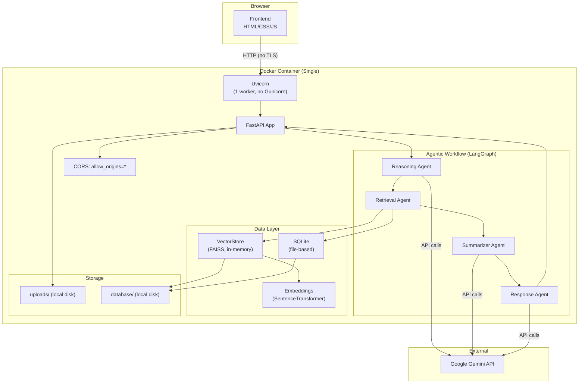
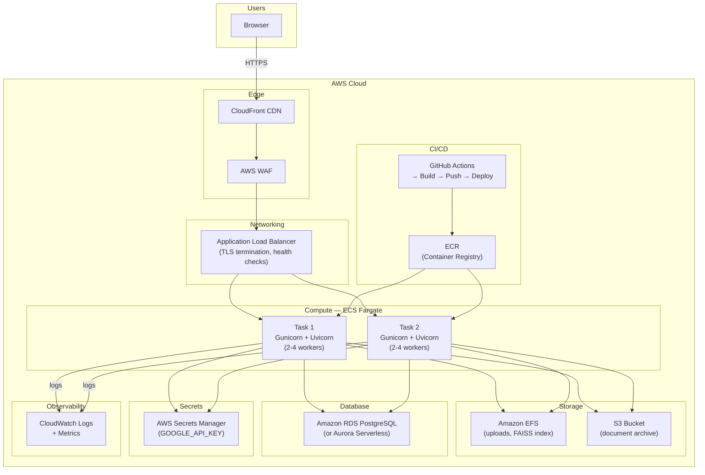
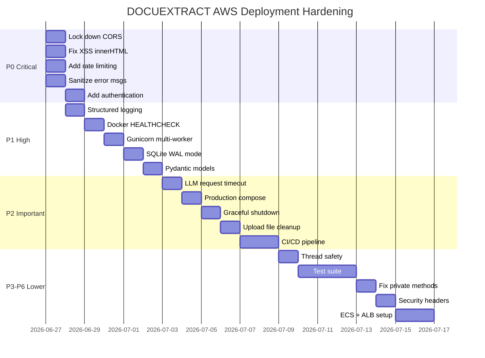

# DOCUEXTRACT — Systems Architecture Review & AWS Deployment Readiness

> **Reviewed:** 2026-06-27 | **Reviewer:** Systems Architect  
> **Scope:** Full codebase scan of [DOCUEXTRACT/](file:///e:/projects/Project201/DOCUEXTRACT) for deployment readiness on AWS

---

## Executive Summary

DOCUEXTRACT is a well-structured Agentic RAG application with a clear separation of concerns (agents → core orchestration → pipeline → storage). However, the codebase is currently at **prototype/demo quality** and requires significant hardening before production deployment on AWS. The issues span **security, observability, reliability, scalability, data integrity, code quality, and AWS-specific infrastructure**.

Below is every shortcoming found, organized by priority tier with detailed implementation steps.

---

## Current Architecture



## Proposed AWS Target Architecture



---

## Priority Legend

| Tier | Label | Meaning |
|------|-------|---------|
| **P0** | 🔴 Critical | Security vulnerability or data-loss risk — **must fix before any public exposure** |
| **P1** | 🟠 High | Deployment blocker — app will fail or misbehave on AWS without this |
| **P2** | 🟡 Important | Operational necessity — you can launch but will regret not having it within days |
| **P3** | 🔵 Moderate | Code quality & reliability — reduces tech debt and prevents subtle bugs |
| **P4** | 🟣 Low | Performance & scalability — matters at production traffic levels |
| **P5** | ⚪ Enhancement | Nice-to-have improvements for production maturity |
| **P6** | 🪨 Hardening | Deep hardening for long-term AWS production |

---

## P0 — 🔴 Critical (Security & Data Loss)

### P0.1 — CORS Is Wide Open (`allow_origins=["*"]`)

**File:** [app.py](file:///e:/projects/Project201/DOCUEXTRACT/backend/app.py#L13-L18)

**What is CORS?** Cross-Origin Resource Sharing (CORS) is a browser security feature. When your frontend at `https://your-app.com` makes a request to your API, the browser checks the API's CORS headers to see if `your-app.com` is allowed. Right now, the code says `allow_origins=["*"]` which means **every website in the world** is allowed. An attacker could build a malicious website that makes requests to your API and steal data.

**Risk:** Any website on the internet can make authenticated requests to your API. An attacker can craft a malicious page that uploads documents, reads your Q&A history, and exfiltrates data from any user who visits it.

**Current Code (the problem):**
```python
# In backend/app.py, lines 13-18 — THIS is the problem:
app.add_middleware(
    CORSMiddleware,
    allow_origins=["*"],       # ← THIS allows EVERY website
    allow_methods=["*"],
    allow_headers=["*"],
)
```

**Implementation Steps:**

**Step 1 — Add `allowed_origins` to the Settings class in [config.py](file:///e:/projects/Project201/DOCUEXTRACT/backend/config.py)**

Open [config.py](file:///e:/projects/Project201/DOCUEXTRACT/backend/config.py) and find the `Settings` class (line 27). Add a new field inside it. The `Settings` class should look like this after your change:

```python
@dataclass(slots=True)
class Settings:
    app_name: str = "Agentic RAG System"
    google_api_key: str = _get_google_api_key()
    gemini_model: str = _get_env("GEMINI_MODEL", "gemini-2.5-flash")
    upload_dir: Path = BASE_DIR / "uploads"
    vector_store_dir: Path = BASE_DIR / "database"
    sqlite_db_path: Path = BASE_DIR / "database" / "app.db"
    embedding_model: str = _get_env("EMBEDDING_MODEL", "sentence-transformers/all-MiniLM-L6-v2")
    chunk_size: int = int(_get_env("CHUNK_SIZE", "500"))
    chunk_overlap: int = int(_get_env("CHUNK_OVERLAP", "50"))
    retrieval_k: int = int(_get_env("RETRIEVAL_K", "4"))
    max_file_size_mb: int = int(_get_env("MAX_FILE_SIZE_MB", "20"))
    # ↓↓↓ ADD THIS NEW LINE ↓↓↓
    allowed_origins: list[str] = field(default_factory=lambda: [
        origin.strip()
        for origin in _get_env("ALLOWED_ORIGINS", "http://localhost:8000").split(",")
        if origin.strip()
    ])
```

You also need to add `field` to the imports. At the top of [config.py](file:///e:/projects/Project201/DOCUEXTRACT/backend/config.py), change:
```diff
- from dataclasses import dataclass
+ from dataclasses import dataclass, field
```

**Step 2 — Update CORS middleware in [app.py](file:///e:/projects/Project201/DOCUEXTRACT/backend/app.py#L13-L18)**

Open [app.py](file:///e:/projects/Project201/DOCUEXTRACT/backend/app.py) and find the `add_middleware` call (line 13). Replace only the `allow_origins` value:

```diff
 app.add_middleware(
     CORSMiddleware,
-    allow_origins=["*"],
+    allow_origins=settings.allowed_origins,
     allow_methods=["*"],
     allow_headers=["*"],
+    allow_credentials=True,
 )
```

**Step 3 — Add `ALLOWED_ORIGINS` to [.env.example](file:///e:/projects/Project201/DOCUEXTRACT/.env.example)**

Add this line at the end of the file:
```
ALLOWED_ORIGINS=https://your-domain.com,https://www.your-domain.com
```

**Step 4 — Also add it to your actual `.env` file**

For local development, set:
```
ALLOWED_ORIGINS=http://localhost:8000,http://127.0.0.1:8000
```

> [!TIP]
> **How to verify it works:** After making the change, start the app and open your browser DevTools (F12 → Network tab). Make a request from the frontend. The response headers should include `Access-Control-Allow-Origin: http://localhost:8000` (NOT `*`). If you see CORS errors in the console, your origin URL in `.env` doesn't match exactly — check for trailing slashes, http vs https, and port numbers.

> [!WARNING]
> **Things to keep in mind:**
> - Origins must match **exactly** — `http://localhost:8000` and `http://localhost:8000/` (with trailing slash) are DIFFERENT origins. Do NOT include a trailing slash.
> - When you deploy to AWS, you must update `ALLOWED_ORIGINS` to your actual domain (e.g., `https://docuextract.yourdomain.com`). If you forget, the frontend will stop working with CORS errors.
> - If you're using CloudFront or a reverse proxy, the origin is the URL your **users** type in the browser, not the internal ALB URL.
> - During development, if CORS blocks your requests and you're stuck, temporarily add `http://localhost:8000` to your `.env` origins — but **never** put `*` back in production.
> - The `allow_credentials=True` flag is needed if you later add cookie-based auth. It is harmless to add now.

---

### P0.2 — XSS via `innerHTML` in Frontend

**File:** [app.js](file:///e:/projects/Project201/DOCUEXTRACT/frontend/app.js#L83-L86)

**What is XSS?** Cross-Site Scripting (XSS) is when an attacker injects malicious JavaScript into your webpage. In this app, when a user asks a question, that question text is stored in the database and later displayed in the "Recent Questions" history section. The current code uses `innerHTML` to render it — which means if someone types `<script>alert('hacked')</script>` as their question, the browser will **execute** that script for every user who views the history.

**Risk:** A stored XSS attack is possible — if a user submits a question like ``, it will execute JavaScript for every user who views history. An attacker could steal session tokens, redirect users, or inject phishing forms.

**Current Code (the problem):**
```javascript
// In frontend/app.js, lines 83-86 — inside the renderHistory function:
entry.innerHTML = `
  <span class="history-question">${item.question}</span>
  <span class="history-meta">${item.used_gemini ? "Gemini answer" : "Fallback answer"} • ${item.created_at}</span>
`;
// ↑ item.question comes from the database and is user-controlled!
// Using innerHTML with user data = XSS vulnerability
```

**Why is this dangerous?** The `innerHTML` property tells the browser "parse this string as HTML and execute any scripts in it." The `textContent` property tells the browser "display this string as plain text, do NOT execute anything." We need to switch from `innerHTML` to `textContent`.

**Implementation Steps:**

**Step 1 — Find the `renderHistory` function in [app.js](file:///e:/projects/Project201/DOCUEXTRACT/frontend/app.js#L67-L99)**

Open [app.js](file:///e:/projects/Project201/DOCUEXTRACT/frontend/app.js) and scroll to around line 67. You'll see the `renderHistory` function. Inside its `items.forEach(...)` loop (around line 79-98), there's a block that creates history item buttons.

**Step 2 — Replace the `innerHTML` assignment (lines 83-86)**

Find this exact block:
```javascript
    entry.innerHTML = `
      <span class="history-question">${item.question}</span>
      <span class="history-meta">${item.used_gemini ? "Gemini answer" : "Fallback answer"} • ${item.created_at}</span>
    `;
```

Replace it with this safe version using `textContent` and `createElement`:
```javascript
    const questionSpan = document.createElement("span");
    questionSpan.className = "history-question";
    questionSpan.textContent = item.question;
    const metaSpan = document.createElement("span");
    metaSpan.className = "history-meta";
    metaSpan.textContent = `${item.used_gemini ? "Gemini answer" : "Fallback answer"} • ${item.created_at}`;
    entry.appendChild(questionSpan);
    entry.appendChild(metaSpan);
```

**Step 3 — Check for other `innerHTML` usages in the same file**

There are other `innerHTML` usages in [app.js](file:///e:/projects/Project201/DOCUEXTRACT/frontend/app.js) (lines 38, 68, 72, 121). However, those are safe because they only write **hardcoded static HTML strings** — not user-controlled data. For example, `historyList.innerHTML = '<article class="history-empty">No questions asked yet.</article>';` is fine because no user data is in the string. Do NOT change those — they're safe and changing them unnecessarily adds complexity.

> [!TIP]
> **How to verify it works:** After the change, start the app and try submitting a question with HTML in it, such as `<b>test</b>` or `<script>alert(1)</script>`. When you view it in the history section, you should see the raw text `<b>test</b>` displayed — NOT bold text. If the text appears bold, the fix didn't work.

> [!WARNING]
> **Things to keep in mind:**
> - **Do NOT use `innerHTML` with any data that came from user input, API responses, or the database.** Always use `textContent` or `createElement` for dynamic data.
> - Make sure you replace the `entry.innerHTML = ...` block completely. Don't leave the old line in — even a commented-out `innerHTML` with user data is confusing for future developers.
> - The replacement code uses `document.createElement` to build DOM nodes programmatically. This is slightly more verbose than `innerHTML` but is **inherently safe** because `textContent` never parses HTML.
> - The `item.created_at` value comes from the server's database (auto-generated timestamp), so it's low-risk. But using `textContent` for it too is best practice.
> - **Do NOT** try to "sanitize" HTML by stripping `<script>` tags — there are hundreds of XSS bypasses. The only safe approach is to never use `innerHTML` with user data.

---

### P0.3 — No Rate Limiting on API Endpoints

**Files:** [routes.py](file:///e:/projects/Project201/DOCUEXTRACT/backend/api/routes.py), [app.py](file:///e:/projects/Project201/DOCUEXTRACT/backend/app.py)

**What is Rate Limiting?** Rate limiting restricts how many requests a user can make in a given time period. Without it, a single user (or a bot) can call your API thousands of times per second. Each call to `/ask` triggers a Gemini API call that costs money and uses CPU for embeddings. Without limits, someone could rack up hundreds of dollars in Gemini bills in minutes.

**Risk:** Any user (or bot) can flood `/upload` and `/ask` endpoints, causing:
- Unbounded Gemini API costs (billing attack — someone could cost you $100+ in minutes)
- CPU exhaustion from embedding generation (server becomes unresponsive)
- Disk exhaustion from unlimited uploaded files
- SQLite lock contention (database crashes under concurrent writes)

**Implementation Steps:**

**Step 1 — Install the `slowapi` package**

Open [requirements.txt](file:///e:/projects/Project201/DOCUEXTRACT/requirements.txt) and add this line at the end:
```
slowapi==0.1.9
```

Then install it in your virtual environment:
```powershell
# If using venv:
.\.venv\Scripts\pip.exe install slowapi==0.1.9

# Or if using the system pip:
pip install slowapi==0.1.9
```

**Step 2 — Create a limiter instance in a NEW file [backend/rate_limit.py](file:///e:/projects/Project201/DOCUEXTRACT/backend)**

> [!IMPORTANT]
> **Why a separate file?** If you put the limiter in `app.py` and import it in `routes.py`, you'll get a **circular import error** because `app.py` already imports from `routes.py` (via the router). Creating a separate file breaks this cycle. This is the #1 mistake beginners make with slowapi in FastAPI.

Create a new file `backend/rate_limit.py` with this content:
```python
"""Rate limiting configuration — separated to avoid circular imports."""
from __future__ import annotations

from slowapi import Limiter
from slowapi.util import get_remote_address

# get_remote_address extracts the user's IP address from each request.
# This means limits are per-IP — each unique IP gets its own counter.
limiter = Limiter(key_func=get_remote_address)
```

**Step 3 — Register the limiter in [app.py](file:///e:/projects/Project201/DOCUEXTRACT/backend/app.py)**

Open [app.py](file:///e:/projects/Project201/DOCUEXTRACT/backend/app.py) and add these lines. Here is the complete file after the change:

```python
from __future__ import annotations

from fastapi import FastAPI
from fastapi.middleware.cors import CORSMiddleware
from fastapi.responses import FileResponse
from fastapi.staticfiles import StaticFiles
from slowapi import _rate_limit_exceeded_handler          # ← ADD
from slowapi.errors import RateLimitExceeded              # ← ADD

from backend.api.routes import router
from backend.config import BASE_DIR, settings
from backend.rate_limit import limiter                    # ← ADD


app = FastAPI(title=settings.app_name)
app.state.limiter = limiter                               # ← ADD
app.add_exception_handler(RateLimitExceeded, _rate_limit_exceeded_handler)  # ← ADD
app.add_middleware(
    CORSMiddleware,
    allow_origins=settings.allowed_origins,  # (after P0.1 fix)
    allow_methods=["*"],
    allow_headers=["*"],
    allow_credentials=True,
)
app.include_router(router)

frontend_dir = BASE_DIR / "frontend"
app.mount("/static", StaticFiles(directory=frontend_dir), name="static")


@app.get("/")
def serve_frontend() -> FileResponse:
    return FileResponse(frontend_dir / "index.html")
```

**Step 4 — Add rate limit decorators to endpoints in [routes.py](file:///e:/projects/Project201/DOCUEXTRACT/backend/api/routes.py)**

Open [routes.py](file:///e:/projects/Project201/DOCUEXTRACT/backend/api/routes.py) and make these changes:

1. Add these imports at the top:
   ```python
   from fastapi import APIRouter, File, HTTPException, Query, Request, UploadFile  # ← add Request
   from backend.rate_limit import limiter                    # ← ADD
   ```

2. Add `@limiter.limit(...)` decorators and `request: Request` parameter to each endpoint you want to protect:
   ```python
   @router.post("/upload")
   @limiter.limit("5/minute")   # ← ADD this decorator
   async def upload_document(request: Request, file: UploadFile = File(...)):  # ← ADD request param
       # ... rest of the function stays exactly the same

   @router.post("/ask")
   @limiter.limit("10/minute")  # ← ADD this decorator
   def ask_question(request: Request, payload: dict[str, str]):  # ← ADD request param
       # ... rest of the function stays exactly the same
   ```

> [!IMPORTANT]
> **The `request: Request` parameter is REQUIRED.** slowapi needs access to the request object to read the client's IP address. If you forget to add `request: Request` as the **first parameter** of the function, you will get a runtime error: `TypeError: 'Request' object is not callable` or similar. The parameter name MUST be exactly `request`.

> [!TIP]
> **How to verify it works:** After making the change, start the app and rapidly submit 6 uploads or 11 questions in a row (within 1 minute). You should get an HTTP `429 Too Many Requests` response with a "Rate limit exceeded" message. If you still get normal responses after rapid requests, the limiter isn't working — check that `app.state.limiter` is set.

> [!WARNING]
> **Things to keep in mind:**
> - **Circular import trap:** Do NOT import `limiter` from `app.py` in `routes.py`. Always use the separate `rate_limit.py` file. This is the most common beginner mistake.
> - **`request: Request` must be the FIRST parameter** in any rate-limited endpoint function. If it's not first, FastAPI may interpret it as a query parameter and you'll get confusing 422 errors.
> - The `@limiter.limit()` decorator must go **below** the `@router.post()` decorator (closer to the function), not above it.
> - Rate limits like `"5/minute"` mean 5 requests per rolling 60-second window per IP address. Adjust these numbers based on your expected usage.
> - **Behind a proxy (like AWS ALB or CloudFront):** By default, `get_remote_address` reads the direct connection IP. Behind a proxy, all requests appear to come from the proxy's IP. You'll need to configure `limiter = Limiter(key_func=get_remote_address, default_limits=["100/minute"])` and set `proxy_fix` or use `X-Forwarded-For` header. This is a production concern for later — the basic setup works for initial deployment.
> - If you're running locally and testing with `127.0.0.1`, all your requests count as the same IP. This is expected behavior.

---

### P0.4 — No Authentication or Authorization

**Files:** All routes in [routes.py](file:///e:/projects/Project201/DOCUEXTRACT/backend/api/routes.py)

**What is this about?** Right now, every API endpoint (`/upload`, `/ask`, `/health`, `/history`) is completely open. Anyone who knows the URL can use them with no password, no API key, no login — nothing. This means a stranger can upload files to your server, run queries (burning Gemini API credits that YOU pay for), and read all your Q&A history.

**Risk:** Every endpoint is publicly accessible. Anyone can upload malicious documents, read Q&A history, and consume Gemini API credits. On AWS, bots scan public IPs continuously — your API will be found and abused within hours of deployment.

**Implementation Steps:**

**Step 1 — Add `APP_API_KEY` setting to [config.py](file:///e:/projects/Project201/DOCUEXTRACT/backend/config.py)**

Open [config.py](file:///e:/projects/Project201/DOCUEXTRACT/backend/config.py) and add a new field to the `Settings` class:

```python
@dataclass(slots=True)
class Settings:
    app_name: str = "Agentic RAG System"
    google_api_key: str = _get_google_api_key()
    # ... all existing fields stay the same ...
    max_file_size_mb: int = int(_get_env("MAX_FILE_SIZE_MB", "20"))
    allowed_origins: list[str] = ...  # (from P0.1)
    # ↓↓↓ ADD THIS NEW LINE ↓↓↓
    app_api_key: str = _get_env("APP_API_KEY", "")
```

**Step 2 — Create a NEW file [backend/core/auth.py](file:///e:/projects/Project201/DOCUEXTRACT/backend/core)**

Create a brand-new file at `backend/core/auth.py` with this complete content:

```python
"""API key authentication dependency for FastAPI."""
from __future__ import annotations

from fastapi import Header, HTTPException

from backend.config import settings


async def verify_api_key(x_api_key: str = Header(default=None)) -> None:
    """
    FastAPI dependency that checks the X-Api-Key header.

    Behavior:
    - If APP_API_KEY is empty/not set in .env → auth is DISABLED (dev mode)
    - If APP_API_KEY is set → every request MUST include a matching header
    """
    # If no API key is configured, skip auth (useful for local development)
    if not settings.app_api_key:
        return

    # If API key is configured but request doesn't include the header
    if x_api_key is None:
        raise HTTPException(
            status_code=401,
            detail="Missing X-Api-Key header. Include your API key in the request.",
        )

    # If the key doesn't match
    if x_api_key != settings.app_api_key:
        raise HTTPException(
            status_code=401,
            detail="Invalid API key.",
        )
```

**Step 3 — Apply auth dependency to the router in [routes.py](file:///e:/projects/Project201/DOCUEXTRACT/backend/api/routes.py)**

Open [routes.py](file:///e:/projects/Project201/DOCUEXTRACT/backend/api/routes.py) and make two changes:

1. Add the import at the top:
   ```python
   from fastapi import APIRouter, Depends, File, HTTPException, Query, Request, UploadFile
   from backend.core.auth import verify_api_key
   ```

2. Change the router line to include the dependency:
   ```diff
   - router = APIRouter()
   + router = APIRouter(dependencies=[Depends(verify_api_key)])
   ```

This applies authentication to **ALL** routes under this router, including `/health`, `/history`, `/upload`, and `/ask`.

**Step 4 — Update the frontend to send the API key in [app.js](file:///e:/projects/Project201/DOCUEXTRACT/frontend/app.js)**

Now the frontend needs to send the API key with every request. Add a constant at the top of [app.js](file:///e:/projects/Project201/DOCUEXTRACT/frontend/app.js) and update every `fetch` call:

```javascript
// At the very top of app.js, add:
const API_KEY = "";  // Leave empty for dev mode. Set this when APP_API_KEY is configured.

function apiHeaders(extra = {}) {
  const headers = { ...extra };
  if (API_KEY) {
    headers["X-Api-Key"] = API_KEY;
  }
  return headers;
}
```

Then update each `fetch` call to include headers:
```javascript
// For GET requests (like /health and /history), add headers:
const response = await fetch("/health", { headers: apiHeaders() });
const response = await fetch("/history", { headers: apiHeaders() });

// For POST /upload (FormData), add headers:
const response = await fetch("/upload", {
  method: "POST",
  headers: apiHeaders(),     // ← ADD this line (do NOT set Content-Type, FormData sets it automatically)
  body: formData,
});

// For POST /ask (JSON), merge with Content-Type:
const response = await fetch("/ask", {
  method: "POST",
  headers: apiHeaders({ "Content-Type": "application/json" }),
  body: JSON.stringify({ question }),
});
```

**Step 5 — Add `APP_API_KEY` to [.env.example](file:///e:/projects/Project201/DOCUEXTRACT/.env.example) and your `.env`**

```
APP_API_KEY=your_secret_api_key_here
```

Generate a strong key:
```powershell
python -c "import secrets; print(secrets.token_urlsafe(32))"
```

> [!TIP]
> **How to verify it works:**
> 1. Set `APP_API_KEY=test123` in your `.env` file
> 2. Start the app
> 3. Open `http://localhost:8000/health` in your browser — you should get a `401 Unauthorized` error
> 4. Test with curl: `curl -H "X-Api-Key: test123" http://localhost:8000/health` — should return 200 OK
> 5. Test with a wrong key: `curl -H "X-Api-Key: wrong" http://localhost:8000/health` — should return 401
> 6. Remove `APP_API_KEY` from `.env` (or set it empty) — everything should work without the header (dev mode)

> [!WARNING]
> **Things to keep in mind:**
> - **The `Header(default=None)` is important.** If you use `Header(...)` (with the ellipsis), FastAPI will return a 422 error when the header is missing instead of your custom 401. Using `default=None` lets you handle the missing header yourself with a clear error message.
> - **Don't hardcode the API key in `app.js` for production.** The JavaScript source is visible to anyone. For production, either: (a) use environment variables injected at build time, (b) use a proper login/session system, or (c) put the frontend behind CloudFront with AWS WAF rules.
> - **`Depends(verify_api_key)` on the router level** applies to ALL endpoints. If you later want `/health` to be public (for ALB health checks), remove it from the router-level dependency and apply it only to specific endpoints instead:
>   ```python
>   router = APIRouter()  # No global dependency
>   
>   @router.get("/health")  # Public — no auth
>   def health(): ...
>   
>   @router.post("/upload", dependencies=[Depends(verify_api_key)])  # Protected
>   async def upload_document(...): ...
>   ```
> - **For production on AWS**, consider using AWS Cognito or an API Gateway authorizer instead of a static API key. But the static API key is a good starting point.

---

### P0.5 — Gemini API Key Exposed in Error Messages

**Files:** [rag_pipeline.py](file:///e:/projects/Project201/DOCUEXTRACT/backend/rag_pipeline.py#L136), [response_agent.py](file:///e:/projects/Project201/DOCUEXTRACT/backend/agents/response_agent.py#L56)

**What is this about?** When the Gemini API call fails (e.g., bad API key, quota exceeded, network timeout), the code catches the exception and includes the **raw error message** in the response sent to the user. Python exception messages from API libraries often include sensitive details: partial API keys, internal URLs, request headers, and stack traces. This information should never reach the frontend.

**Risk:** When Gemini API calls fail, the raw exception string (which may contain API key fragments, internal URLs, or stack traces) is returned to the frontend via `_fallback_answer(..., error=str(exc))`. An attacker can intentionally trigger errors to extract your API key.

**Current Code (the problem):**

In [rag_pipeline.py](file:///e:/projects/Project201/DOCUEXTRACT/backend/rag_pipeline.py#L135-L136), line 135-136:
```python
# This sends the RAW exception text to the user!!
except Exception as exc:
    return self._fallback_answer(question, retrieved_chunks, error=str(exc)), False
#                                                                   ^^^^^^^^^
# str(exc) could contain: "403 Client Error: API key AIzaSy... is invalid"
```

In [response_agent.py](file:///e:/projects/Project201/DOCUEXTRACT/backend/agents/response_agent.py#L53-L60), line 53-60:
```python
except Exception as exc:
    errors = [*state.get("errors", []), f"Response agent fallback: {exc}"]
    return {
        "answer": self.pipeline._fallback_answer(state["question"], retrieved_chunks, error=str(exc)),
        #                                                                                 ^^^^^^^^^
        # Same problem: raw exception text goes to the user
```

**Implementation Steps:**

**Step 1 — Fix in [rag_pipeline.py](file:///e:/projects/Project201/DOCUEXTRACT/backend/rag_pipeline.py)**

Open [rag_pipeline.py](file:///e:/projects/Project201/DOCUEXTRACT/backend/rag_pipeline.py) and find the `_generate_answer` method (around line 121). Add a logger at the **top of the file** (after the other imports) and fix the except block:

```python
# At the top of rag_pipeline.py, add after the existing imports:
import logging

logger = logging.getLogger(__name__)
```

Then find the except block in `_generate_answer` (around line 135) and change:
```diff
  except Exception as exc:
-     return self._fallback_answer(question, retrieved_chunks, error=str(exc)), False
+     logger.exception("Gemini API call failed for question: %s", question[:100])
+     return self._fallback_answer(
+         question,
+         retrieved_chunks,
+         error="The AI model is temporarily unavailable. Please try again.",
+     ), False
```

**Step 2 — Fix in [response_agent.py](file:///e:/projects/Project201/DOCUEXTRACT/backend/agents/response_agent.py)**

Open [response_agent.py](file:///e:/projects/Project201/DOCUEXTRACT/backend/agents/response_agent.py) and add a logger at the top:

```python
import logging

logger = logging.getLogger(__name__)
```

Then find the except block (around line 53) and change:
```diff
  except Exception as exc:
-     errors = [*state.get("errors", []), f"Response agent fallback: {exc}"]
+     logger.exception("Response agent Gemini call failed")
+     errors = [*state.get("errors", []), "Response agent fell back due to model error"]
      return {
-         "answer": self.pipeline._fallback_answer(state["question"], retrieved_chunks, error=str(exc)),
+         "answer": self.pipeline._fallback_answer(
+             state["question"],
+             retrieved_chunks,
+             error="The AI model is temporarily unavailable. Please try again.",
+         ),
```

**Step 3 — Also fix in [reasoning_agent.py](file:///e:/projects/Project201/DOCUEXTRACT/backend/agents/reasoning_agent.py#L40-L44) and [summarizer_agent.py](file:///e:/projects/Project201/DOCUEXTRACT/backend/agents/summarizer_agent.py#L41-L47)**

Apply the same pattern: add `import logging` + `logger = logging.getLogger(__name__)` at the top, and replace `f"...fallback: {exc}"` with a generic string + `logger.exception(...)`.

In [reasoning_agent.py](file:///e:/projects/Project201/DOCUEXTRACT/backend/agents/reasoning_agent.py), line 41:
```diff
- errors = [*state.get("errors", []), f"Reasoning agent fallback: {exc}"]
+ logger.exception("Reasoning agent Gemini call failed")
+ errors = [*state.get("errors", []), "Reasoning agent fell back due to model error"]
```

In [summarizer_agent.py](file:///e:/projects/Project201/DOCUEXTRACT/backend/agents/summarizer_agent.py), line 42:
```diff
- errors = [*state.get("errors", []), f"Summarizer agent fallback: {exc}"]
+ logger.exception("Summarizer agent Gemini call failed")
+ errors = [*state.get("errors", []), "Summarizer agent fell back due to model error"]
```

> [!TIP]
> **How to verify it works:**
> 1. Temporarily set an **invalid** `GOOGLE_API_KEY` in your `.env` (e.g., `GOOGLE_API_KEY=invalid_key_12345`)
> 2. Start the app, upload a document, and ask a question
> 3. The answer should say "The AI model is temporarily unavailable" — NOT show any raw exception text
> 4. Check your terminal/console output — the full error with stack trace should be logged there
> 5. Restore your valid API key after testing

> [!WARNING]
> **Things to keep in mind:**
> - **`logger.exception(...)` automatically includes the full stack trace** in the log output. You don't need to add `str(exc)` to the log message — the traceback is appended automatically. This is different from `logger.error(...)` which does NOT include the traceback.
> - **Never include `str(exc)` in anything that reaches the user.** This includes: HTTP response bodies, HTML pages, JSON responses, and even the `errors` list in the workflow state (because that gets returned in the `/ask` response).
> - **The logger won't work until you implement P1.1 (Structured Logging).** However, adding the `logger` calls now is correct — they simply won't produce output until you configure logging. The critical fix is replacing `error=str(exc)` with a generic message, which works immediately.
> - Make sure to place `import logging` and `logger = logging.getLogger(__name__)` at the **module level** (top of the file), not inside a function.

---

## P1 — 🟠 High (Deployment Blockers)

### P1.1 — No Structured Logging

**Files:** Entire backend — **zero** `import logging` statements found.

**What is this about?** Your entire backend has no logging. When something goes wrong in production (an upload fails, a Gemini call hangs, the FAISS index corrupts), you'll have **zero information** about what happened. Python’s built-in `logging` module outputs structured messages to stdout, which AWS CloudWatch Logs then collects automatically. Without this, debugging on AWS is blind guesswork.

**Risk:** On AWS (ECS/CloudWatch), you will have no visibility into request flow, errors, LLM latency, or upload failures. Debugging production issues becomes impossible.

**Implementation Steps:**

**Step 1 — Create a NEW file [backend/logging_config.py](file:///e:/projects/Project201/DOCUEXTRACT/backend)**

Create a new file `backend/logging_config.py` with this complete content:

```python
"""Centralized logging configuration for the DOCUEXTRACT backend."""
from __future__ import annotations

import logging
import sys


def setup_logging() -> None:
    """
    Configure structured JSON logging to stdout.

    Why JSON? AWS CloudWatch Logs can parse JSON log lines automatically,
    letting you search by level, logger name, or message content. Plain text
    logs are much harder to search and filter.

    Why stdout (not a file)? Docker containers should log to stdout/stderr.
    The container runtime (ECS, Docker Compose) captures these streams and
    routes them to the configured log driver (CloudWatch, json-file, etc.).
    Writing to a file inside the container is unreliable and the file is lost
    when the container restarts.
    """
    logging.basicConfig(
        level=logging.INFO,
        format='{"time":"%(asctime)s","level":"%(levelname)s","logger":"%(name)s","message":"%(message)s"}',
        handlers=[logging.StreamHandler(sys.stdout)],
        force=True,  # Override any existing config from third-party libraries
    )
    # Suppress noisy third-party loggers that spam INFO-level messages
    logging.getLogger("httpcore").setLevel(logging.WARNING)
    logging.getLogger("httpx").setLevel(logging.WARNING)
    logging.getLogger("sentence_transformers").setLevel(logging.WARNING)
    logging.getLogger("urllib3").setLevel(logging.WARNING)
```

**Step 2 — Call `setup_logging()` in [app.py](file:///e:/projects/Project201/DOCUEXTRACT/backend/app.py)**

Open [app.py](file:///e:/projects/Project201/DOCUEXTRACT/backend/app.py) and add this **at the very top**, before the `app = FastAPI(...)` line:

```python
from backend.logging_config import setup_logging

setup_logging()  # Must be called before any other imports that might log
```

Place it right after the imports, before `app = FastAPI(...)`. The exact placement matters — `setup_logging()` must run before any module tries to log.

**Step 3 — Add a logger to each backend module**

In **every** `.py` file under `backend/`, add these two lines near the top (after imports):

```python
import logging

logger = logging.getLogger(__name__)
```

Here is the list of files you need to update (add `import logging` and `logger = logging.getLogger(__name__)` to each):

| File | Already has `import logging`? |
|------|------------------------------|
| [app.py](file:///e:/projects/Project201/DOCUEXTRACT/backend/app.py) | No — add it |
| [config.py](file:///e:/projects/Project201/DOCUEXTRACT/backend/config.py) | No — add it |
| [database.py](file:///e:/projects/Project201/DOCUEXTRACT/backend/database.py) | No — add it |
| [document_loader.py](file:///e:/projects/Project201/DOCUEXTRACT/backend/document_loader.py) | No — add it |
| [embeddings.py](file:///e:/projects/Project201/DOCUEXTRACT/backend/embeddings.py) | No — add it |
| [chunking.py](file:///e:/projects/Project201/DOCUEXTRACT/backend/chunking.py) | No — add it |
| [vector_store.py](file:///e:/projects/Project201/DOCUEXTRACT/backend/vector_store.py) | No — add it |
| [rag_pipeline.py](file:///e:/projects/Project201/DOCUEXTRACT/backend/rag_pipeline.py) | After P0.5 — yes |
| [api/routes.py](file:///e:/projects/Project201/DOCUEXTRACT/backend/api/routes.py) | No — add it |
| [core/agentic_workflow.py](file:///e:/projects/Project201/DOCUEXTRACT/backend/core/agentic_workflow.py) | No — add it |
| [core/llm_factory.py](file:///e:/projects/Project201/DOCUEXTRACT/backend/core/llm_factory.py) | No — add it |
| [agents/reasoning_agent.py](file:///e:/projects/Project201/DOCUEXTRACT/backend/agents/reasoning_agent.py) | After P0.5 — yes |
| [agents/response_agent.py](file:///e:/projects/Project201/DOCUEXTRACT/backend/agents/response_agent.py) | After P0.5 — yes |
| [agents/retrieval_agent.py](file:///e:/projects/Project201/DOCUEXTRACT/backend/agents/retrieval_agent.py) | No — add it |
| [agents/summarizer_agent.py](file:///e:/projects/Project201/DOCUEXTRACT/backend/agents/summarizer_agent.py) | After P0.5 — yes |

**Step 4 — Add meaningful log statements to key operations**

Here are the most important places to add logging:

**In [api/routes.py](file:///e:/projects/Project201/DOCUEXTRACT/backend/api/routes.py)** — log every upload and question:
```python
@router.post("/upload")
async def upload_document(...):
    logger.info("Upload started: filename=%s, size=%.2fMB", file.filename, size_mb)
    # ... existing code ...
    logger.info("Upload complete: filename=%s, chunks=%d", file.filename, payload.get("chunks_added", 0))

@router.post("/ask")
def ask_question(...):
    logger.info("Question received: %s", question[:100])
    # ... existing code ...
    logger.info("Question answered: used_gemini=%s", result.get("used_gemini"))
```

**In [vector_store.py](file:///e:/projects/Project201/DOCUEXTRACT/backend/vector_store.py)** — replace silent except:
```diff
  except Exception:
-     self._faiss_index = None
+     logger.warning("FAISS index rebuild failed, falling back to brute-force search", exc_info=True)
+     self._faiss_index = None
```

**In [embeddings.py](file:///e:/projects/Project201/DOCUEXTRACT/backend/embeddings.py)** — replace silent fallback:
```diff
  except Exception:
-     return HashEmbeddingBackend()
+     logger.warning("SentenceTransformer failed to load, using hash-based embeddings", exc_info=True)
+     return HashEmbeddingBackend()
```

> [!TIP]
> **How to verify it works:** After adding logging, start the app and perform an upload. You should see JSON-formatted log lines in your terminal like:
> ```json
> {"time":"2026-06-27 12:00:00","level":"INFO","logger":"backend.api.routes","message":"Upload started: filename=test.pdf, size=0.12MB"}
> ```
> If you see nothing, check that `setup_logging()` is being called before `app = FastAPI(...)`.

> [!WARNING]
> **Things to keep in mind:**
> - **`__name__` is important.** Using `logging.getLogger(__name__)` creates a logger named after the module (e.g., `backend.api.routes`). This helps you identify WHERE a log message came from. Do NOT use `logging.getLogger("mylogger")` or just `logging.getLogger()` (the root logger).
> - **`force=True` in `basicConfig`** is needed because some third-party libraries (like `sentence-transformers`) may call `basicConfig` first during import. Without `force=True`, your config would be silently ignored.
> - **Do NOT log sensitive data.** Never log full question text (truncate to 100 chars), API keys, or file contents. Log metadata only (filename, size, chunk count, timing).
> - **`exc_info=True`** adds the full traceback to `logger.warning()`. `logger.exception()` always adds the traceback automatically. They are different methods — use `exception()` inside `except` blocks, and `warning(..., exc_info=True)` elsewhere.
> - **You must do this step for P0.5's logger calls to actually produce output.** P0.5 adds `logger.exception()` calls, but without `setup_logging()`, Python's default logging config suppresses everything below WARNING level.

---

### P1.2 — No Docker HEALTHCHECK

**File:** [Dockerfile](file:///e:/projects/Project201/DOCUEXTRACT/Dockerfile)

**What is this about?** A Docker HEALTHCHECK tells Docker (and AWS ECS) how to verify that your application is actually running and responding. Without it, Docker/ECS only knows if the **process** is alive — not if it's **actually serving requests**. Your app could be deadlocked, out of memory, or in an infinite loop, and ECS would think everything is fine.

**Risk:** AWS ECS uses health checks to determine if a task is healthy. Without one, ECS cannot detect if your app is deadlocked, OOM, or in a crash loop — and won't restart it. You'll have a container that's "running" but not serving any requests.

**Implementation Steps:**

**Step 1 — Install `curl` in the Dockerfile**

Open [Dockerfile](file:///e:/projects/Project201/DOCUEXTRACT/Dockerfile) and find the `RUN apt-get update` line (line 10). Add `curl` to the install list:

```diff
 RUN apt-get update \
-    && apt-get install -y --no-install-recommends ca-certificates libgomp1 \
+    && apt-get install -y --no-install-recommends ca-certificates libgomp1 curl \
     && useradd --create-home --user-group --shell /usr/sbin/nologin appuser \
     && rm -rf /var/lib/apt/lists/*
```

**Step 2 — Add the HEALTHCHECK instruction**

Add this line **after** the `EXPOSE 8000` line and **before** the `CMD` line in your [Dockerfile](file:///e:/projects/Project201/DOCUEXTRACT/Dockerfile):

```dockerfile
HEALTHCHECK --interval=30s --timeout=10s --start-period=60s --retries=3 \
    CMD curl -f http://localhost:8000/health || exit 1
```

The complete end of your Dockerfile should look like:
```dockerfile
USER appuser

EXPOSE 8000

HEALTHCHECK --interval=30s --timeout=10s --start-period=60s --retries=3 \
    CMD curl -f http://localhost:8000/health || exit 1

CMD ["gunicorn", "backend.app:app", ...]
```

**What the parameters mean:**
- `--interval=30s` — Check every 30 seconds
- `--timeout=10s` — If the check takes longer than 10 seconds, consider it failed
- `--start-period=60s` — Wait 60 seconds after startup before starting checks (your app loads a SentenceTransformer model which takes time)
- `--retries=3` — Mark as unhealthy after 3 consecutive failures

> [!TIP]
> **How to verify it works:** After rebuilding the image, run `docker inspect --format='{{json .State.Health}}' <container_id>` to see the health status. You should see `"Status":"healthy"`. If the status is `"starting"`, wait for the start period to pass.

> [!WARNING]
> **Things to keep in mind:**
> - **`--start-period=60s` is critical.** Your app takes time to load the SentenceTransformer model (~20-40 seconds). If you set this too low, the health check will fail during startup and ECS will keep killing and restarting your task in an infinite loop. If model loading takes longer on your machine, increase this to `90s` or `120s`.
> - **`curl -f` makes curl return exit code 1 on HTTP errors** (4xx, 5xx). Without `-f`, curl returns 0 for any HTTP response, even errors.
> - If you added API key auth (P0.4) to the `/health` endpoint, the health check will fail with 401. You MUST either: (a) make `/health` public (no auth), or (b) pass the API key in the curl command: `curl -f -H "X-Api-Key: $APP_API_KEY" http://localhost:8000/health`.
> - **The HEALTHCHECK uses `localhost`**, not `0.0.0.0`. This is correct — the check runs inside the same container.

---

### P1.3 — Single-Worker Uvicorn Without Gunicorn

**File:** [Dockerfile](file:///e:/projects/Project201/DOCUEXTRACT/Dockerfile#L29)

**What is this about?** Currently, the app runs with `uvicorn` directly with a single worker process. This means:
- If one user asks a question that takes 30 seconds (waiting for Gemini), ALL other users are blocked and see a spinning loader
- If the single worker process crashes (out of memory, unhandled exception), the entire container dies with no recovery
- On a multi-core ECS task, only 1 core is utilized while the others sit idle

Gunicorn is a production-grade process manager that spawns multiple Uvicorn workers. Each worker handles requests independently, so one slow request doesn't block others.

**Risk:** Running bare `uvicorn` with a single worker means:
- A single slow LLM request blocks all other users
- No process management (if the worker dies, the container dies)
- Cannot utilize multi-core ECS tasks

**Implementation Steps:**

**Step 1 — Add `gunicorn` to [requirements.txt](file:///e:/projects/Project201/DOCUEXTRACT/requirements.txt)**

Open [requirements.txt](file:///e:/projects/Project201/DOCUEXTRACT/requirements.txt) and add this line at the end:
```
gunicorn==23.0.0
```

**Step 2 — Update the CMD in [Dockerfile](file:///e:/projects/Project201/DOCUEXTRACT/Dockerfile#L29)**

Find the last line in your Dockerfile (the `CMD` line) and replace it:

```diff
- CMD ["python", "-m", "uvicorn", "backend.app:app", "--host", "0.0.0.0", "--port", "8000"]
+ CMD ["gunicorn", "backend.app:app", \
+      "--worker-class", "uvicorn.workers.UvicornWorker", \
+      "--workers", "2", \
+      "--bind", "0.0.0.0:8000", \
+      "--timeout", "120", \
+      "--graceful-timeout", "30", \
+      "--access-logfile", "-"]
```

**What each flag means:**
- `--worker-class uvicorn.workers.UvicornWorker` — Use Uvicorn as the worker (needed for async FastAPI)
- `--workers 2` — Run 2 worker processes (each handles requests independently)
- `--bind 0.0.0.0:8000` — Listen on all interfaces, port 8000
- `--timeout 120` — Kill a worker if it takes longer than 120 seconds on a single request (Gemini calls can be slow)
- `--graceful-timeout 30` — Wait 30 seconds for a worker to finish current requests before force-killing it during shutdown
- `--access-logfile -` — Print access logs to stdout (so CloudWatch can see them)

**Step 3 — Keep your local dev command unchanged**

For local development, you can still use the original command:
```powershell
python -m uvicorn backend.app:app --reload
```

The Gunicorn CMD only applies inside the Docker container. `--reload` doesn't work with Gunicorn (it's a dev-only feature), so this separation is correct.

> [!TIP]
> **How to verify it works:** After rebuilding the Docker image, run the container and check logs. You should see Gunicorn startup messages like:
> ```
> [INFO] Starting gunicorn 23.0.0
> [INFO] Listening at: http://0.0.0.0:8000
> [INFO] Using worker: uvicorn.workers.UvicornWorker
> [INFO] Booting worker with pid: 8
> [INFO] Booting worker with pid: 9
> ```
> Two worker PIDs means 2 workers are running. Test by making two requests simultaneously — both should be processed without blocking each other.

> [!WARNING]
> **Things to keep in mind:**
> - **Memory: Each worker loads its own copy of everything** — SentenceTransformer model (~90MB), FAISS index, SQLite connection. With 2 workers, expect ~1–1.5GB RAM total. With 4 workers, ~2–3GB. Size your ECS task memory accordingly (set at least 2× the expected usage to avoid OOM kills).
> - **`--workers 2` is a good starting point.** The formula is `2 × CPU_CORES + 1`, but since each worker holds a large ML model, start with 2 and increase only if you have enough RAM.
> - **`--timeout 120` prevents hung workers.** Gemini API calls can take 30-60 seconds. If you set timeout too low (e.g., 30s), Gunicorn will kill workers during normal LLM calls. 120 seconds is safe.
> - **Gunicorn only works on Linux/macOS**, not Windows. This is fine because you're running it inside a Docker container (which is Linux). For local Windows development, keep using `uvicorn` directly.
> - **Do NOT use `--reload` with Gunicorn in production.** It's a Uvicorn-only flag for development.
> - **If your app fails to start with Gunicorn**, the most common error is `ModuleNotFoundError: No module named 'gunicorn'` — this means you forgot to add `gunicorn` to `requirements.txt` or didn't rebuild the Docker image.

---

### P1.4 — SQLite in Production (Concurrency & Durability)

**File:** [database.py](file:///e:/projects/Project201/DOCUEXTRACT/backend/database.py)

**What is this about?** SQLite is a file-based database — it stores everything in a single file (`database/app.db`). This is great for development but has serious problems in production:
- **Concurrent writes fail.** If two workers try to write at the same time, one gets a `database is locked` error.
- **Container restarts lose data.** If the SQLite file is inside the container (not on a mounted volume), restarting the container deletes all data.
- **EFS + SQLite is fragile.** Amazon EFS (the shared filesystem for ECS) has higher latency than local disk, which can break SQLite's file-locking mechanism.

**Risk:** SQLite is not designed for concurrent writes from multiple workers/containers. You will encounter `database is locked` errors. SQLite on EFS (or container-local) is fragile — container restarts lose data, EFS has latency that breaks SQLite locking.

**Implementation Steps (Staged):**

This fix is done in two stages. Stage 1 is a quick fix you should do now. Stage 2 is a larger migration you'll do before scaling to multiple containers.

**Stage 1 — Immediate mitigation (keep SQLite, do this NOW)**

Open [database.py](file:///e:/projects/Project201/DOCUEXTRACT/backend/database.py) and find the `_connect` method (around line 187). The current code is:

```python
# CURRENT CODE (line 187-190):
def _connect(self) -> sqlite3.Connection:
    connection = sqlite3.connect(self.db_path)
    connection.row_factory = sqlite3.Row
    return connection
```

Replace it with:

```python
# UPDATED CODE:
def _connect(self) -> sqlite3.Connection:
    connection = sqlite3.connect(self.db_path, timeout=30)
    connection.row_factory = sqlite3.Row
    connection.execute("PRAGMA journal_mode=WAL")
    connection.execute("PRAGMA busy_timeout=5000")
    return connection
```

**What each change does:**
- `timeout=30` — Wait up to 30 seconds for a lock instead of failing immediately (the default is 5 seconds, which is too short)
- `PRAGMA journal_mode=WAL` — Enables Write-Ahead Logging, which allows concurrent readers while one writer is active. This is the single most important change for SQLite concurrency.
- `PRAGMA busy_timeout=5000` — SQLite-level retry timeout (5 seconds). This is a backup to the Python-level timeout.

**Stage 2 — Production migration (before multi-container deployment)**

When you need to scale to multiple ECS tasks (containers), you must migrate to PostgreSQL:
1. Create an Amazon RDS PostgreSQL instance (or Aurora Serverless v2 for auto-scaling)
2. Replace `sqlite3` calls with `psycopg2` or `asyncpg` + `sqlalchemy`
3. Abstract the database layer behind an interface so the swap is non-breaking

> [!TIP]
> **How to verify Stage 1 works:** After changing `_connect`, start the app and upload a document. Check the `database/` directory — you should now see `app.db-wal` and `app.db-shm` files alongside `app.db`. These are the WAL journal files and confirm that WAL mode is active.

> [!WARNING]
> **Things to keep in mind:**
> - **WAL mode creates additional files.** After enabling WAL, you'll see `app.db-wal` and `app.db-shm` next to `app.db`. These are normal and essential. If you copy `app.db` without these files, you may lose recent data.
> - **WAL mode persists.** Once you set `journal_mode=WAL`, it stays even after the connection closes. You only need to set it once, but setting it on every connection is harmless.
> - **SQLite with WAL allows ONE writer at a time** but MANY concurrent readers. This is fine for a single Docker container with 2 workers (one writes, the other waits briefly). It will NOT work with multiple containers sharing the same file on EFS.
> - **Do NOT use SQLite on a network filesystem in production** (EFS, NFS, S3-mounted). SQLite relies on POSIX file locking, which network filesystems often emulate incorrectly.
> - **For your Docker volumes,** the `docker-compose.yml` mounts `./database:/app/database`, so the SQLite file survives container restarts. This is correct for single-container deployment but won't work with multiple ECS tasks.

---

### P1.5 — No Pydantic Request Validation on `/ask`

**File:** [routes.py](file:///e:/projects/Project201/DOCUEXTRACT/backend/api/routes.py#L59-L65)

**What is this about?** The `/ask` endpoint currently accepts a raw `dict[str, str]` as input. This means:
- FastAPI's auto-generated API docs (at `/docs`) show a generic "any object" schema instead of describing the expected fields
- If someone sends `{"q": "hello"}` instead of `{"question": "hello"}`, the app crashes with a confusing 500 Internal Server Error instead of a clear "field 'question' is required" message
- There's no limit on question length — someone could send a 10MB question string

Pydantic models tell FastAPI exactly what shape the request body should have, and FastAPI automatically validates it and returns clear 422 errors for bad input.

**Risk:** The `/ask` endpoint accepts a raw `dict[str, str]` — no validation, no type safety, no documentation in OpenAPI schema. Malformed requests produce confusing 500 errors instead of clean 422s.

**Implementation Steps:**

**Step 1 — Add the Pydantic model to [models.py](file:///e:/projects/Project201/DOCUEXTRACT/backend/core/models.py)**

Open [models.py](file:///e:/projects/Project201/DOCUEXTRACT/backend/core/models.py). Currently it only has the `AgenticRAGState` TypedDict. Add a new Pydantic class at the **end** of the file:

```python
# Add these imports at the top of the file:
from pydantic import BaseModel, Field

# Then add this class BELOW the existing AgenticRAGState:
class AskRequest(BaseModel):
    """Request body for the /ask endpoint."""
    question: str = Field(
        ...,
        min_length=1,
        max_length=2000,
        description="The question to ask about uploaded documents",
        examples=["What are the key responsibilities in this document?"],
    )
```

The complete file should look like:
```python
from __future__ import annotations

from typing import Any, TypedDict

from pydantic import BaseModel, Field


class AgenticRAGState(TypedDict, total=False):
    question: str
    reasoning: str
    retrieval_query: str
    response_strategy: str
    summary: str
    answer: str
    sources: list[str]
    retrieved_chunks: list[dict[str, Any]]
    workflow_steps: list[str]
    used_gemini: bool
    provider: str
    errors: list[str]


class AskRequest(BaseModel):
    """Request body for the /ask endpoint."""
    question: str = Field(
        ...,
        min_length=1,
        max_length=2000,
        description="The question to ask about uploaded documents",
        examples=["What are the key responsibilities in this document?"],
    )
```

**Step 2 — Update the `/ask` endpoint in [routes.py](file:///e:/projects/Project201/DOCUEXTRACT/backend/api/routes.py)**

Open [routes.py](file:///e:/projects/Project201/DOCUEXTRACT/backend/api/routes.py) and make two changes:

1. Add the import near the top:
   ```python
   from backend.core.models import AskRequest
   ```

2. Find the `ask_question` function (around line 59) and change its parameter:
   ```diff
   - def ask_question(payload: dict[str, str]) -> dict[str, object]:
   -     question = (payload.get("question") or "").strip()
   + def ask_question(payload: AskRequest) -> dict[str, object]:
   +     question = payload.question.strip()
   ```

**Step 3 — Verify the frontend still works**

The frontend already sends `{ "question": "..." }` as JSON, so no frontend changes are needed. The Pydantic model matches the existing request format.

> [!TIP]
> **How to verify it works:**
> 1. Start the app and open `http://localhost:8000/docs` in your browser
> 2. Find the `/ask` endpoint — it should now show a schema with a required `question` field (not a generic dict)
> 3. Try sending an empty question: `curl -X POST http://localhost:8000/ask -H "Content-Type: application/json" -d '{"question": ""}'` — you should get a 422 with "String should have at least 1 character"
> 4. Try sending without the field: `curl -X POST http://localhost:8000/ask -H "Content-Type: application/json" -d '{}'` — you should get a 422 with "Field required"

> [!WARNING]
> **Things to keep in mind:**
> - **`Field(...)` with the ellipsis (`...`) means the field is REQUIRED.** If you use `Field(default="")` instead, the field becomes optional with a default — which defeats the purpose.
> - **Pydantic is already installed** — it's in [requirements.txt](file:///e:/projects/Project201/DOCUEXTRACT/requirements.txt) as `pydantic==2.12.1` (FastAPI depends on it). No new package install needed.
> - **The `max_length=2000` protects against abuse.** Without it, someone could send a multi-megabyte question string. Adjust the limit based on your use case.
> - **`BaseModel` vs `TypedDict`:** Don't confuse these. `AgenticRAGState` is a `TypedDict` (used for LangGraph state — it's a plain dict type hint). `AskRequest` is a Pydantic `BaseModel` (used for FastAPI request validation — it parses and validates data). They serve different purposes and both belong in the same file.
> - **The `examples` field** in `Field()` shows up in the `/docs` Swagger UI, making it easier for API consumers to understand what to send.

---

### P1.6 — Missing `.env` File Handling / AWS Secrets Manager Integration

**Files:** [config.py](file:///e:/projects/Project201/DOCUEXTRACT/backend/config.py), [docker-compose.yml](file:///e:/projects/Project201/DOCUEXTRACT/docker-compose.yml)

**What is this about?** Your app uses a `.env` file to store the `GOOGLE_API_KEY` and other settings. This works fine for local development, but on AWS you should NEVER store secrets in files that could accidentally end up in your Docker image or Git repository. AWS has a dedicated service called **Secrets Manager** that securely stores and rotates secrets.

**Risk:** The app depends on a `.env` file for `GOOGLE_API_KEY`. On AWS ECS, secrets should come from AWS Secrets Manager or SSM Parameter Store — not from files baked into images or mounted volumes.

**Current Status — What's Already Good:**
- ✅ Config reads from `os.getenv` via the `_get_env()` function — this works with ECS environment variables automatically
- ✅ `.env` is listed in [.dockerignore](file:///e:/projects/Project201/DOCUEXTRACT/.dockerignore) — it won't be baked into the Docker image
- ✅ `.env` is listed in [.gitignore](file:///e:/projects/Project201/DOCUEXTRACT/.gitignore) — it won't be committed to Git

**Implementation Steps:**

**Step 1 — Verify `.env` is NOT in Git (already done)**

Run this command to make sure `.env` is not tracked:
```powershell
cd e:\projects\Project201\DOCUEXTRACT
git ls-files .env
```
If the output is empty, you're good. If it shows `.env`, you need to remove it:
```powershell
git rm --cached .env
git commit -m "Remove .env from tracking"
```

**Step 2 — Add a startup validation to [config.py](file:///e:/projects/Project201/DOCUEXTRACT/backend/config.py)**

Add a check that warns (but doesn't crash) if no API key is found. Add this after `settings = Settings()`:

```python
import logging

logger = logging.getLogger(__name__)

if not settings.google_api_key:
    logger.warning(
        "No GOOGLE_API_KEY found. The app will run in fallback mode "
        "(heuristic answers without Gemini). Set GOOGLE_API_KEY or "
        "GEMINI_API_KEY in your environment or .env file."
    )
```

**Step 3 — For AWS deployment: Configure secrets in ECS Task Definition**

When deploying to AWS, you'll configure secrets in the ECS Task Definition (not in a `.env` file). Here's how:

1. **Store the API key in AWS Secrets Manager:**
   ```bash
   aws secretsmanager create-secret \
       --name docuextract/google-api-key \
       --secret-string "your-actual-google-api-key"
   ```

2. **Reference it in your ECS Task Definition** (see the template in P6.1):
   ```json
   "secrets": [{
       "name": "GOOGLE_API_KEY",
       "valueFrom": "arn:aws:secretsmanager:us-east-1:123456789:secret:docuextract/google-api-key"
   }]
   ```

3. ECS will inject the secret as an environment variable at runtime. Your `config.py` reads `os.getenv("GOOGLE_API_KEY")`, so it will automatically pick it up. **No code changes needed.**

4. **Non-secret configuration** (like `GEMINI_MODEL`, `CHUNK_SIZE`) goes in the `environment` section of the task definition:
   ```json
   "environment": [
       {"name": "GEMINI_MODEL", "value": "gemini-2.5-flash"},
       {"name": "ALLOWED_ORIGINS", "value": "https://your-domain.com"},
       {"name": "APP_API_KEY", "value": "your-app-api-key"}
   ]
   ```

> [!TIP]
> **How to verify:** On ECS, your container will have the environment variable available. You can verify by checking the `/health` endpoint — it should report `"provider": "gemini"` (not `"heuristic-fallback"`).

> [!WARNING]
> **Things to keep in mind:**
> - **NEVER put secrets in the `environment` section of a task definition.** The `environment` block is visible in the AWS Console and CloudTrail logs. Always use the `secrets` block with Secrets Manager ARNs.
> - **Your ECS task execution role** needs permission to read from Secrets Manager. Add the `secretsmanager:GetSecretValue` permission to the execution role.
> - **`load_dotenv()` in [config.py](file:///e:/projects/Project201/DOCUEXTRACT/backend/config.py#L11) is harmless on ECS** — if no `.env` file exists, it simply does nothing. You don't need to remove it. It falls back to `os.getenv()` which reads ECS-injected environment variables.
> - **Don't confuse task role vs execution role.** The *execution role* is what ECS uses to pull images and secrets during startup. The *task role* is what your application code uses to call AWS services. Secrets Manager permissions go on the *execution role*.

---

## P2 — 🟡 Important (Operational Necessities)

### P2.1 — No CI/CD Pipeline

**Risk:** Manual Docker builds and deployments are error-prone and non-repeatable.

**Implementation Steps:**

1. Create `.github/workflows/deploy.yml`:
   ```yaml
   name: Build & Deploy
   on:
     push:
       branches: [main]
   jobs:
     build:
       runs-on: ubuntu-latest
       steps:
         - uses: actions/checkout@v4
         - uses: aws-actions/configure-aws-credentials@v4
           with:
             aws-access-key-id: ${{ secrets.AWS_ACCESS_KEY_ID }}
             aws-secret-access-key: ${{ secrets.AWS_SECRET_ACCESS_KEY }}
             aws-region: us-east-1
         - uses: aws-actions/amazon-ecr-login@v2
         - run: |
             docker build -t $ECR_REPO:${{ github.sha }} .
             docker push $ECR_REPO:${{ github.sha }}
         - run: |
             # Update ECS service with new task definition
             aws ecs update-service --cluster docuextract --service docuextract-svc --force-new-deployment
   ```

---

### P2.2 — No Graceful Shutdown Handling

**Files:** [app.py](file:///e:/projects/Project201/DOCUEXTRACT/backend/app.py), all agents

**Risk:** When ECS stops a task (during deployments or scaling), in-flight LLM requests are aborted mid-response. Users get broken answers or 502 errors.

**Implementation Steps:**

1. Add a shutdown event to [app.py](file:///e:/projects/Project201/DOCUEXTRACT/backend/app.py):
   ```python
   import signal
   
   @app.on_event("shutdown")
   async def shutdown_event():
       logger.info("Graceful shutdown initiated — finishing in-flight requests")
   ```
2. Configure Gunicorn's `--graceful-timeout 30` (already included in P1.3).
3. In ECS Task Definition, set `stopTimeout: 30`.

---

### P2.3 — Uploaded Files Are Never Cleaned Up

**File:** [rag_pipeline.py](file:///e:/projects/Project201/DOCUEXTRACT/backend/rag_pipeline.py#L46-L48)

**Risk:** Every uploaded document is permanently stored in `/app/uploads/`. On a long-running deployment, this will exhaust disk space.

**Implementation Steps:**

1. Add a cleanup policy — either:
   - **Option A:** Delete the uploaded file after successful ingestion (keep only the vector index):
     ```python
     # After successful embedding and indexing, remove the raw file
     destination.unlink(missing_ok=True)
     ```
   - **Option B:** Archive to S3 and delete locally:
     ```python
     import boto3
     s3 = boto3.client("s3")
     s3.upload_file(str(destination), "docuextract-uploads", safe_name)
     destination.unlink(missing_ok=True)
     ```
2. Add a configurable `UPLOAD_RETENTION_DAYS` setting.

---

### P2.4 — No Request Timeout on LLM Calls

**Files:** [reasoning_agent.py](file:///e:/projects/Project201/DOCUEXTRACT/backend/agents/reasoning_agent.py#L29), [summarizer_agent.py](file:///e:/projects/Project201/DOCUEXTRACT/backend/agents/summarizer_agent.py#L39), [response_agent.py](file:///e:/projects/Project201/DOCUEXTRACT/backend/agents/response_agent.py#L46)

**Risk:** Gemini API calls can hang indefinitely. A single stuck request blocks the worker forever, cascading into total service unavailability.

**Implementation Steps:**

1. In [llm_factory.py](file:///e:/projects/Project201/DOCUEXTRACT/backend/core/llm_factory.py#L16-L21), add timeout:
   ```diff
    return ChatGoogleGenerativeAI(
        model=settings.gemini_model,
        google_api_key=settings.google_api_key,
        temperature=0.2,
        max_retries=2,
   +    timeout=60,
   +    max_output_tokens=4096,
    )
   ```
2. In the direct `google.genai` call in [rag_pipeline.py](file:///e:/projects/Project201/DOCUEXTRACT/backend/rag_pipeline.py#L127-L131), wrap with a timeout:
   ```python
   from google.genai import types
   response = client.models.generate_content(
       model=self.settings.gemini_model,
       contents=prompt,
       config=types.GenerateContentConfig(
           response_mime_type="text/plain",
           timeout=60,
       ),
   )
   ```

---

### P2.5 — Docker Compose Is Inadequate for Production

**File:** [docker-compose.yml](file:///e:/projects/Project201/DOCUEXTRACT/docker-compose.yml)

**Risk:** The compose file has no resource limits, no restart policy, no health check, no logging config.

**Implementation Steps:**

Update [docker-compose.yml](file:///e:/projects/Project201/DOCUEXTRACT/docker-compose.yml):
```yaml
services:
  docuextract:
    build: .
    ports:
      - "8000:8000"
    env_file:
      - .env
    volumes:
      - ./uploads:/app/uploads
      - ./database:/app/database
    restart: unless-stopped
    deploy:
      resources:
        limits:
          memory: 4G
          cpus: "2.0"
    healthcheck:
      test: ["CMD", "curl", "-f", "http://localhost:8000/health"]
      interval: 30s
      timeout: 10s
      retries: 3
      start_period: 60s
    logging:
      driver: json-file
      options:
        max-size: "50m"
        max-file: "5"
```

---

## P3 — 🔵 Moderate (Code Quality & Reliability)

### P3.1 — Global Mutable Singletons Are Thread-Unsafe

**File:** [routes.py](file:///e:/projects/Project201/DOCUEXTRACT/backend/api/routes.py#L14)

**Risk:** `service = AgenticRAGService(settings=settings)` is a module-level global. With multiple workers (Gunicorn), each worker gets its own copy — which is correct. But within a single worker, concurrent async requests sharing the same FAISS index and SQLite connection can cause data corruption.

**Implementation Steps:**

1. Add a threading lock around write operations in [vector_store.py](file:///e:/projects/Project201/DOCUEXTRACT/backend/vector_store.py):
   ```python
   import threading
   
   class VectorStore:
       def __post_init__(self):
           self._lock = threading.Lock()
           ...
       
       def add(self, texts, embeddings, metadatas):
           with self._lock:
               # existing add logic
   ```
2. Similarly protect SQLite writes in [database.py](file:///e:/projects/Project201/DOCUEXTRACT/backend/database.py).

---

### P3.2 — Bare `except Exception:` Silently Swallows Errors

**Files:**
- [vector_store.py:124](file:///e:/projects/Project201/DOCUEXTRACT/backend/vector_store.py#L124) — FAISS rebuild
- [embeddings.py:49](file:///e:/projects/Project201/DOCUEXTRACT/backend/embeddings.py#L49) — embedding backend fallback
- [rag_pipeline.py:73](file:///e:/projects/Project201/DOCUEXTRACT/backend/rag_pipeline.py#L73) — file ingestion cleanup

**Risk:** Errors are silently eaten, making debugging impossible. A FAISS import failure, for instance, will silently fall back to brute-force search with no indication to the operator.

**Implementation Steps:**

For each bare `except Exception:`, add logging:
```diff
- except Exception:
-     self._faiss_index = None
+ except Exception:
+     logger.warning("FAISS index rebuild failed, falling back to brute-force search", exc_info=True)
+     self._faiss_index = None
```

---

### P3.3 — Agents Access Private Methods Across Module Boundaries

**Files:**
- [retrieval_agent.py:18](file:///e:/projects/Project201/DOCUEXTRACT/backend/agents/retrieval_agent.py#L18) — `self.pipeline._build_sources(...)`
- [response_agent.py:27](file:///e:/projects/Project201/DOCUEXTRACT/backend/agents/response_agent.py#L27) — `self.pipeline._fallback_answer(...)`
- [response_agent.py:67](file:///e:/projects/Project201/DOCUEXTRACT/backend/agents/response_agent.py#L67) — `self.pipeline._display_document_name(...)`
- [summarizer_agent.py:58](file:///e:/projects/Project201/DOCUEXTRACT/backend/agents/summarizer_agent.py#L58) — `self.pipeline._display_document_name(...)`

**Risk:** Private methods (prefixed with `_`) are implementation details that can change without notice. This creates brittle coupling between the agents and the pipeline.

**Implementation Steps:**

1. Rename the following to public methods in [rag_pipeline.py](file:///e:/projects/Project201/DOCUEXTRACT/backend/rag_pipeline.py):
   - `_build_sources` → `build_sources`
   - `_fallback_answer` → `fallback_answer`
   - `_display_document_name` → `display_document_name`
2. Update all call sites in the agent files.

---

### P3.4 — No Test Suite

**Risk:** Zero test files exist in the project. Any code change can break the pipeline without detection.

**Implementation Steps:**

1. Create a `tests/` directory:
   ```
   tests/
   ├── __init__.py
   ├── test_chunking.py
   ├── test_document_loader.py
   ├── test_vector_store.py
   ├── test_database.py
   ├── test_routes.py
   └── conftest.py
   ```
2. Add test dependencies to [requirements.txt](file:///e:/projects/Project201/DOCUEXTRACT/requirements.txt):
   ```
   pytest==8.3.0
   httpx==0.28.0
   pytest-asyncio==1.0.0
   ```
3. Write minimum viable tests:
   - **Chunking:** Verify chunk count, overlap behavior, empty input handling
   - **Document loader:** Test each file type + empty file rejection
   - **Vector store:** Add → search round-trip, persistence
   - **API routes:** Use FastAPI `TestClient` for upload/ask/health/history

---

### P3.5 — `venv/` Directory in Repository

**File:** [DOCUEXTRACT/venv/](file:///e:/projects/Project201/DOCUEXTRACT/venv) exists in the project.

**Risk:** Virtual environments should never be committed to version control. They bloat the repo and are platform-specific.

**Implementation Steps:**

1. Add `venv/` to [.gitignore](file:///e:/projects/Project201/DOCUEXTRACT/.gitignore) (it currently only has `.venv/`):
   ```diff
    .venv/
    .venv-*/
   + venv/
   ```
2. Remove from git tracking:
   ```bash
   git rm -r --cached venv/
   ```

---

## P4 — 🟣 Low (Performance & Scalability)

### P4.1 — FAISS Index Rebuilt from Scratch on Every Add

**File:** [vector_store.py](file:///e:/projects/Project201/DOCUEXTRACT/backend/vector_store.py#L43)

**Risk:** `_rebuild_index()` creates a new `IndexFlatIP` and adds ALL vectors every time a document is uploaded. For large corpora, this becomes increasingly slow.

**Implementation Steps:**

1. Use incremental add instead of full rebuild:
   ```python
   def add(self, texts, embeddings, metadatas):
       ...
       if self._faiss_index is not None:
           self._faiss_index.add(embeddings)
       else:
           self._rebuild_index()
       self._persist()
   ```

---

### P4.2 — Full Vector Store JSON Persisted on Every Write

**File:** [vector_store.py](file:///e:/projects/Project201/DOCUEXTRACT/backend/vector_store.py#L96-L104)

**Risk:** The entire `store.json` (containing ALL texts and metadata) is rewritten on every upload. For large stores, this causes significant I/O latency and potential data loss if the process is killed mid-write.

**Implementation Steps:**

1. Use atomic writes:
   ```python
   import tempfile
   
   def _persist(self):
       # Write to temp file first, then rename (atomic on Linux)
       tmp_fd, tmp_path = tempfile.mkstemp(dir=str(self.storage_dir), suffix=".tmp")
       try:
           with os.fdopen(tmp_fd, 'w', encoding='utf-8') as f:
               json.dump(payload, f, indent=2)
           os.replace(tmp_path, str(self._metadata_path))
       except:
           os.unlink(tmp_path)
           raise
   ```

---

### P4.3 — Embedding Model Loaded Per-Worker, Not Shared

**File:** [embeddings.py](file:///e:/projects/Project201/DOCUEXTRACT/backend/embeddings.py#L18-L21)

**Risk:** Each Gunicorn worker loads its own copy of the SentenceTransformer model (~90MB). With 4 workers, that's ~360MB of duplicate model weights in RAM.

**Implementation Steps (future optimization):**

1. For now, accept the duplication and size workers appropriately (see P1.3 warning).
2. Long-term: Consider running the embedding model as a separate microservice that workers query via HTTP.

---

## P5 — ⚪ Enhancement (Production Maturity)

### P5.1 — No Content Security Policy (CSP) Headers

**File:** [app.py](file:///e:/projects/Project201/DOCUEXTRACT/backend/app.py)

**Implementation Steps:**

Add security headers middleware:
```python
from starlette.middleware.base import BaseHTTPMiddleware

class SecurityHeadersMiddleware(BaseHTTPMiddleware):
    async def dispatch(self, request, call_next):
        response = await call_next(request)
        response.headers["X-Content-Type-Options"] = "nosniff"
        response.headers["X-Frame-Options"] = "DENY"
        response.headers["X-XSS-Protection"] = "1; mode=block"
        response.headers["Referrer-Policy"] = "strict-origin-when-cross-origin"
        response.headers["Content-Security-Policy"] = "default-src 'self'; script-src 'self'; style-src 'self' 'unsafe-inline'"
        return response

app.add_middleware(SecurityHeadersMiddleware)
```

---

### P5.2 — No Favicon or Meta Tags

**File:** [index.html](file:///e:/projects/Project201/DOCUEXTRACT/frontend/index.html#L3-L8)

**Implementation Steps:**

```html
<head>
    <meta charset="UTF-8" />
    <meta name="viewport" content="width=device-width, initial-scale=1.0" />
    <meta name="description" content="DOCUEXTRACT — Agentic RAG system for document analysis with multi-agent workflows" />
    <meta name="robots" content="noindex, nofollow" />
    <link rel="icon" type="image/svg+xml" href="/static/favicon.svg" />
    <title>DOCUEXTRACT — Agentic RAG System</title>
    <link rel="stylesheet" href="/static/styles.css" />
</head>
```

---

### P5.3 — No `.dockerignore` for `venv/`

**File:** [.dockerignore](file:///e:/projects/Project201/DOCUEXTRACT/.dockerignore)

**Risk:** The `.dockerignore` excludes `.venv/` but not `venv/`. The existing `venv/` directory would be sent to the Docker build context, massively slowing builds.

**Implementation Steps:**

Add to [.dockerignore](file:///e:/projects/Project201/DOCUEXTRACT/.dockerignore):
```diff
  .venv/
+ venv/
```

---

### P5.4 — Pin Dependency Versions with Hashes

**File:** [requirements.txt](file:///e:/projects/Project201/DOCUEXTRACT/requirements.txt)

**Risk:** Current pins are exact versions (good), but lack integrity hashes. A supply chain attack could substitute a malicious package.

**Implementation Steps:**

```bash
pip install pip-tools
pip-compile --generate-hashes requirements.in -o requirements.txt
```

---

### P5.5 — Dual Gemini Client Implementations

**Files:** [rag_pipeline.py](file:///e:/projects/Project201/DOCUEXTRACT/backend/rag_pipeline.py#L125-L131) uses `google.genai` directly, while [llm_factory.py](file:///e:/projects/Project201/DOCUEXTRACT/backend/core/llm_factory.py) uses `langchain_google_genai`.

**Risk:** Two different Gemini integration paths create maintenance burden, inconsistent error handling, and double the API surface to test.

**Implementation Steps:**

1. Remove the `google.genai` direct call from `rag_pipeline.py`.
2. Route all LLM calls through `LLMFactory` and the LangGraph agents.
3. The `rag_pipeline.answer_question()` method is now dead code (the agentic workflow handles everything) — remove it or mark it as deprecated.

---

## P6 — 🪨 Hardening (Long-Term AWS Production)

### P6.1 — ECS Task Definition Template

Create an `infrastructure/ecs-task-definition.json`:

```json
{
  "family": "docuextract",
  "networkMode": "awsvpc",
  "requiresCompatibilities": ["FARGATE"],
  "cpu": "1024",
  "memory": "4096",
  "executionRoleArn": "arn:aws:iam::ACCOUNT:role/ecsTaskExecutionRole",
  "containerDefinitions": [{
    "name": "docuextract",
    "image": "ACCOUNT.dkr.ecr.REGION.amazonaws.com/docuextract:latest",
    "portMappings": [{"containerPort": 8000, "protocol": "tcp"}],
    "healthCheck": {
      "command": ["CMD-SHELL", "curl -f http://localhost:8000/health || exit 1"],
      "interval": 30,
      "timeout": 10,
      "retries": 3,
      "startPeriod": 120
    },
    "secrets": [{
      "name": "GOOGLE_API_KEY",
      "valueFrom": "arn:aws:secretsmanager:REGION:ACCOUNT:secret:docuextract/google-api-key"
    }],
    "environment": [
      {"name": "GEMINI_MODEL", "value": "gemini-2.5-flash"},
      {"name": "ALLOWED_ORIGINS", "value": "https://your-domain.com"}
    ],
    "mountPoints": [{
      "sourceVolume": "efs-data",
      "containerPath": "/app/database",
      "readOnly": false
    }],
    "logConfiguration": {
      "logDriver": "awslogs",
      "options": {
        "awslogs-group": "/ecs/docuextract",
        "awslogs-region": "REGION",
        "awslogs-stream-prefix": "ecs"
      }
    }
  }],
  "volumes": [{
    "name": "efs-data",
    "efsVolumeConfiguration": {
      "fileSystemId": "fs-XXXXXXXXX",
      "transitEncryption": "ENABLED"
    }
  }]
}
```

---

### P6.2 — ALB Health Check Path

Configure the ALB target group health check:
- **Path:** `/health`
- **Port:** `8000`
- **Healthy threshold:** 2
- **Unhealthy threshold:** 3
- **Timeout:** 10s
- **Interval:** 30s
- **Success codes:** `200`

---

### P6.3 — CloudWatch Alarms

Set up critical alarms:
- **5xx Error Rate** > 5% for 5 minutes
- **P95 Latency** > 30 seconds on `/ask`
- **ECS Task Count** < desired count
- **ECS Memory Utilization** > 85%
- **Gemini API Error Rate** (from structured logs)

---

### P6.4 — S3 Backend for Document Storage

Replace local `uploads/` directory with S3 for durability and scalability:

```python
# backend/storage.py (NEW FILE)
import boto3
from pathlib import Path

class DocumentStorage:
    def __init__(self, bucket_name: str):
        self.s3 = boto3.client("s3")
        self.bucket = bucket_name
    
    def upload(self, local_path: Path, key: str) -> str:
        self.s3.upload_file(str(local_path), self.bucket, key)
        return f"s3://{self.bucket}/{key}"
    
    def download(self, key: str, local_path: Path) -> Path:
        self.s3.download_file(self.bucket, key, str(local_path))
        return local_path
```

---

## Summary Checklist

> **Last audit:** 2026-06-30 | **Completed: 27 of 31 tasks (87%)** | **All P0–P4 + P5 (excl. P5.4): ✅ Done**

| # | Task | Priority | Status | Effort | Files Affected |
|---|------|----------|--------|--------|----------------|
| P0.1 | Lock down CORS origins | 🔴 Critical | ✅ Done | 15 min | app.py, config.py, .env.example |
| P0.2 | Fix XSS in `innerHTML` | 🔴 Critical | ✅ Done | 20 min | app.js |
| P0.3 | Add rate limiting | 🔴 Critical | ✅ Done | 30 min | app.py, routes.py, requirements.txt |
| P0.4 | Add authentication | 🔴 Critical | ✅ Done | 45 min | NEW auth.py, config.py, routes.py |
| P0.5 | Sanitize error messages | 🔴 Critical | ✅ Done | 15 min | rag_pipeline.py, response_agent.py |
| P1.1 | Add structured logging | 🟠 High | ✅ Done | 1 hr | ALL backend files |
| P1.2 | Docker HEALTHCHECK | 🟠 High | ✅ Done | 10 min | Dockerfile |
| P1.3 | Gunicorn + multi-worker | 🟠 High | ✅ Done | 20 min | Dockerfile, requirements.txt |
| P1.4 | SQLite → WAL mode (or PostgreSQL) | 🟠 High | ✅ Done | 30 min–2 hr | database.py |
| P1.5 | Pydantic request models | 🟠 High | ✅ Done | 15 min | models.py, routes.py |
| P1.6 | AWS Secrets Manager config | 🟠 High | ✅ Done | 30 min | config.py, ECS task def |
| P2.1 | CI/CD pipeline | 🟡 Important | ✅ Done | 2 hr | NEW .github/workflows/ |
| P2.2 | Graceful shutdown | 🟡 Important | ✅ Done | 20 min | app.py |
| P2.3 | Upload file cleanup | 🟡 Important | ✅ Done | 30 min | rag_pipeline.py, config.py |
| P2.4 | LLM request timeout | 🟡 Important | ✅ Done | 15 min | llm_factory.py, rag_pipeline.py, config.py |
| P2.5 | Production docker-compose | 🟡 Important | ✅ Done | 15 min | docker-compose.yml |
| P3.1 | Thread-safety locks | 🔵 Moderate | ✅ Done | 30 min | vector_store.py, database.py |
| P3.2 | Log bare except blocks | 🔵 Moderate | ✅ Done | 20 min | vector_store.py, embeddings.py, rag_pipeline.py |
| P3.3 | Fix private method access | 🔵 Moderate | ✅ Done | 20 min | rag_pipeline.py, all agents |
| P3.4 | Add test suite | 🔵 Moderate | ❌ Todo | 3 hr | NEW tests/ directory |
| P3.5 | Remove `venv/` from repo | 🔵 Moderate | ✅ Done | 5 min | .gitignore |
| P4.1 | Incremental FAISS add | 🟣 Low | ✅ Done | 20 min | vector_store.py |
| P4.2 | Atomic file writes | 🟣 Low | ✅ Done | 20 min | vector_store.py |
| P4.3 | Shared embedding model | 🟣 Low | ⏭️ Deferred (by design) | 2 hr+ | Architecture change |
| P5.1 | Security headers (CSP) | ⚪ Enhancement | ✅ Done | 15 min | app.py |
| P5.2 | Favicon + meta tags | ⚪ Enhancement | ✅ Done | 10 min | index.html, frontend/favicon.svg |
| P5.3 | Fix `.dockerignore` for `venv/` | ⚪ Enhancement | ✅ Done | 2 min | .dockerignore |
| P5.4 | Pin deps with hashes | ⚪ Enhancement | ⏭️ Deferred (needs pip-tools) | 15 min | requirements.txt |
| P5.5 | Remove dual Gemini client | ⚪ Enhancement | ✅ Done | 30 min | rag_pipeline.py |
| P6.1 | ECS task definition | 🪨 Hardening | ❌ Todo | 1 hr | NEW infrastructure/ |
| P6.2 | ALB health check config | 🪨 Hardening | ❌ Todo | 15 min | Infrastructure |
| P6.3 | CloudWatch alarms | 🪨 Hardening | ❌ Todo | 30 min | Infrastructure |
| P6.4 | S3 document storage | 🪨 Hardening | ❌ Todo | 2 hr | NEW storage.py, rag_pipeline.py |

---

## Recommended Implementation Order



> [!CAUTION]
> **Do not deploy to public AWS without completing all P0 tasks.** The open CORS, missing auth, and XSS vulnerabilities would expose the application to immediate exploitation. Complete P0 + P1 as minimum viable production hardening.

---

## Implementation Audit — Loopholes Found (2026-06-29)

> [!NOTE]
> This section documents deviations from the plan and subtle issues found during a full codebase audit on 2026-06-29.

### L1 — `routes.py` still leaks `str(exc)` for RuntimeError

**File:** [routes.py](file:///e:/projects/Project201/DOCUEXTRACT/backend/api/routes.py#L67-L69)

**Severity:** 🟡 Medium — only affects `RuntimeError` from internal code, not API library errors.

Line 67-69 catches `RuntimeError` and passes `str(exc)` to the HTTP response:
```python
except RuntimeError as exc:
    logger.exception("Upload failed: filename=%s", file.filename)
    raise HTTPException(status_code=500, detail=str(exc)) from exc
```

While the P0.5 fix correctly sanitized all Gemini API error paths, this `RuntimeError` path still sends raw exception text to the frontend. Internal module paths, file names, or error details could leak. Should use a generic message like `"An internal error occurred during upload. Please try again."`.

---

### L2 — `auth.py` has no dev-mode bypass (deviation from P0.4 plan)

**File:** [auth.py](file:///e:/projects/Project201/DOCUEXTRACT/backend/core/auth.py#L16)

**Severity:** 🟢 Low — not a bug, but deviates from the plan.

The P0.4 plan stated: *"If APP_API_KEY is empty/not set in .env → auth is DISABLED (dev mode)."* But:
- [config.py](file:///e:/projects/Project201/DOCUEXTRACT/backend/config.py#L51) defaults `app_api_key` to `"dev-secret-key"` (never empty)
- [auth.py](file:///e:/projects/Project201/DOCUEXTRACT/backend/core/auth.py#L16) always rejects requests without a matching key

This means auth is always enforced. This is actually **more secure** than the plan, but developers starting without `.env` config must know the default key. Consider documenting this in the README.

---

### L3 — `/health` is correctly public, but differs from the plan

**File:** [routes.py](file:///e:/projects/Project201/DOCUEXTRACT/backend/api/routes.py#L17-L23)

**Severity:** 🟢 Low — the implementation is better than the plan.

The P0.4 plan said to use `router = APIRouter(dependencies=[Depends(verify_api_key)])` for global auth. Instead, the implementation uses per-route `dependencies=[Depends(verify_api_key)]` on `/history`, `/upload`, and `/ask` only — leaving `/health` public. This is correct because:
- Docker HEALTHCHECK calls `/health` without an API key
- ALB health checks need unauthenticated access to `/health`

The plan's own warning noted this exact issue. The implementation proactively avoided it.

---

### L4 — `venv/` missing from `.gitignore` and `.dockerignore`

**Files:** [.gitignore](file:///e:/projects/Project201/DOCUEXTRACT/.gitignore), [.dockerignore](file:///e:/projects/Project201/DOCUEXTRACT/.dockerignore)

**Severity:** 🟡 Medium — `venv/` directory exists in the project and is not excluded.

- `.gitignore` only excludes `.venv/` and `.venv-*/` — the `venv/` directory is not listed
- `.dockerignore` only excludes `.venv/` — Docker builds will copy the entire `venv/` into the build context, massively slowing builds
- These are quick fixes tracked in P3.5 and P5.3

---

---

### L5 — Agents still use private methods across module boundaries

**Files:** [retrieval_agent.py:24](file:///e:/projects/Project201/DOCUEXTRACT/backend/agents/retrieval_agent.py#L24), [response_agent.py:30,50,60,71](file:///e:/projects/Project201/DOCUEXTRACT/backend/agents/response_agent.py#L30), [summarizer_agent.py:62](file:///e:/projects/Project201/DOCUEXTRACT/backend/agents/summarizer_agent.py#L62)

**Severity:** 🔵 Low — code quality, no runtime risk.

All four agents still call `self.pipeline._build_sources(...)`, `self.pipeline._fallback_answer(...)`, and `self.pipeline._display_document_name(...)`. These are private methods (prefixed with `_`) being accessed externally. Tracked in P3.3.

---

## Completed P2 Tasks — Post-Implementation Warnings

Below are subtle edge cases or operational issues to keep in mind regarding the completed P2 tasks.

### ⚠️ W1: Immediate File Cleanup (`UPLOAD_RETENTION_DAYS=0`) renders document re-indexing impossible

**Related Task:** P2.3 (Upload File Cleanup)  
**File:** [rag_pipeline.py](file:///e:/projects/Project201/DOCUEXTRACT/backend/rag_pipeline.py#L84-L87)  
**Risk:** When `UPLOAD_RETENTION_DAYS` is set to `0`, the raw uploaded documents are permanently deleted from disk immediately after chunking and indexing. While this saves local disk space, it means:
1. If the vector store index files are ever lost, corrupted, or need their schema changed, the system **cannot re-parse or rebuild** the chunks from the source files. 
2. Any pipeline step that depends on reading the original file (e.g. if we add a feature to show the user a preview of the source PDF) will crash because the file is gone.

*Recommendation:* For critical environments, use `UPLOAD_RETENTION_DAYS > 0` (e.g. `30` days) rather than `0`, or configure S3 backup storage (P6.4) to maintain an archive of the raw files.

### ⚠️ W2: CI/CD Docker base image size and compile speed

**Related Task:** P2.1 (CI/CD Pipeline)  
**File:** [.github/workflows/deploy.yml](file:///e:/projects/Project201/DOCUEXTRACT/.github/workflows/deploy.yml)  
**Risk:** The docker image loads heavy ML libraries like `sentence-transformers` and `torch` (installed via CPU wheels). Because GitHub runners have limited processing power and disk I/O, the Docker build step will take **5 to 10 minutes** per deployment. Additionally, the final image size will exceed 1.5GB, which could cause ECS deployment timeouts if the pull speed is slow.

*Recommendation:* Configure a GitHub Actions build cache for Docker layers, or use a pre-built base image containing `torch` and `sentence-transformers` to speed up compilation in production.

### ⚠️ W3: Lifespan Shutdown Hook assumes Gunicorn handles worker processes gracefully

**Related Task:** P2.2 (Graceful Shutdown)  
**File:** [app.py](file:///e:/projects/Project201/DOCUEXTRACT/backend/app.py#L24-L39)  
**Risk:** The shutdown hook logs that a graceful exit has begun, but it assumes the process manager (Gunicorn) is properly passing signals to worker threads and allowing them to run to completion. If Gunicorn is configured with `--graceful-timeout` but the task runner (AWS ECS) uses a shorter force-kill time (e.g. ECS default of 30s vs Gunicorn 30s), a race condition can cause the container to be terminated before the app completes its lifespan sequence.

*Recommendation:* Always ensure AWS ECS task definition `stopTimeout` is configured slightly higher than Gunicorn's `--graceful-timeout` (e.g. ECS `stopTimeout: 40` vs Gunicorn `--graceful-timeout 30`).

